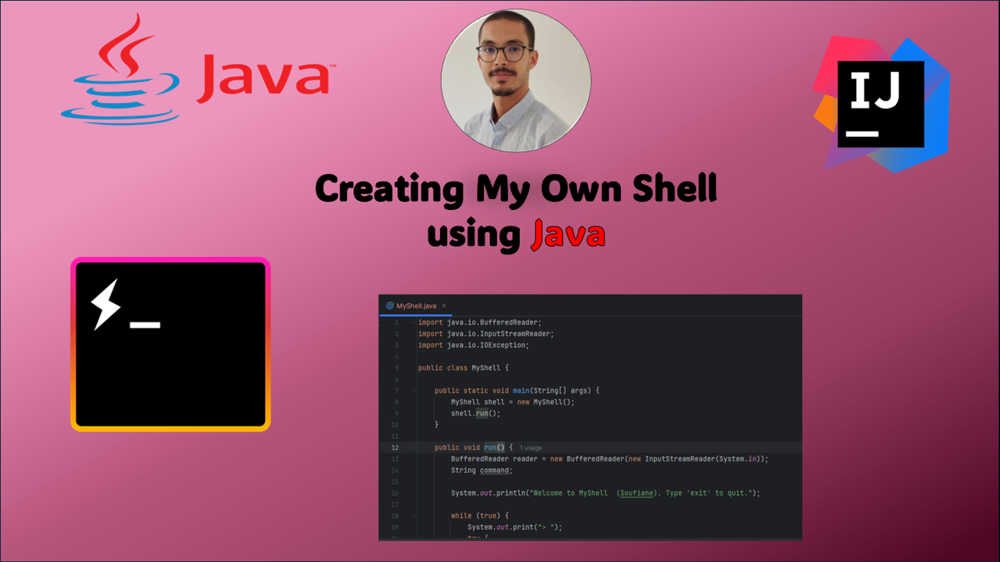
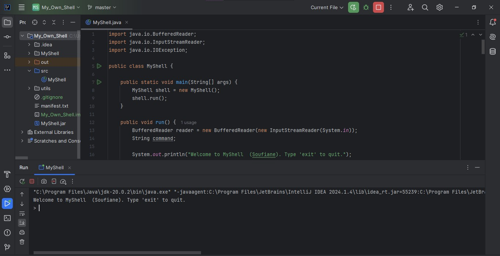
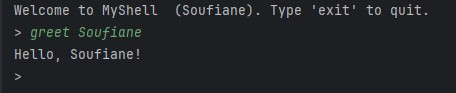
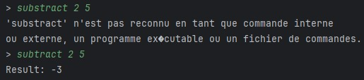
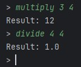
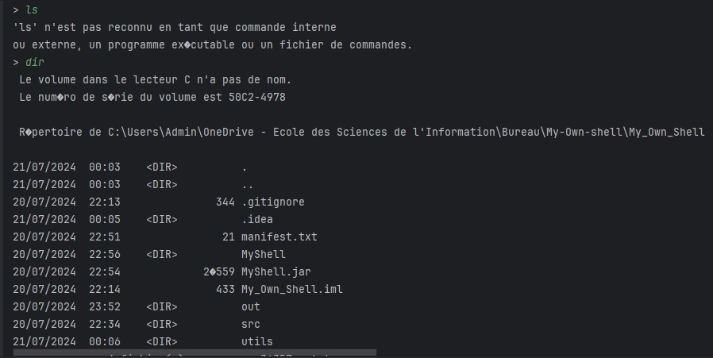
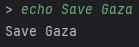
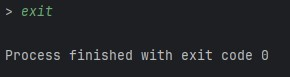

<div align="center">
  
  <h1 style='color:#4c4893' align='center'>
    My Own Shell
  </h1>


  
</div>

<div style="background-color:white; color:black; font-size:15px; font-family:Comic Sans MS; padding:10px; border: 5px solid black;font-weight:bold;border-radius: 20px;">
    Build My Own Shell using java for runing personalized commands like greet , add , substract etc and also external commands of Windows or linux. <br>
</div>


### About the project

This java code make you able to run multiple commands on my shell such as:

* greet:
```bash
greet [Name]
``` 
it returns Hello , Name !



* subtract:
```bash
subtract [number1] [number2]
``` 
it returns the substruction of the two numbers



* multiply and divide:
```bash
multiply [number1] [number2]
divide [number1] [number2]
``` 
it returns the multiplication and division of the two numbers



* External commands:
```bash
dir # for windows
ls # for linux
``` 
it returns the multiplication and division of the two numbers



```bash
echo 
``` 



in the end to quit you run 

```bash
exit 
``` 


<div style="background-color:#4c4893; color:white; font-size:15px; font-family:Comic Sans MS; padding:10px; border: 5px solid black;font-weight:bold;border-radius: 20px;text-align:center"> ✨ THE END ✨</div><br>
